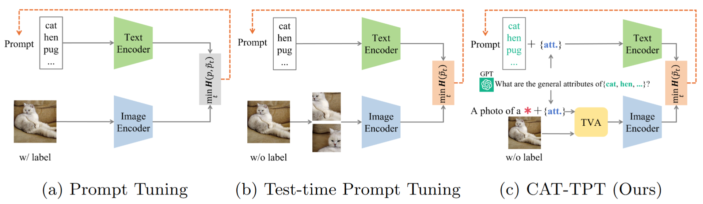

<div align="center">
 <h1>CAT-TPT: Class-Agnostic Text-based Test-time Prompt Tuning for Vision-Language Models</h1>
<div>
    <a href='https://youjia-zhang.github.io/' target='_blank'>Youjia Zhang</a><sup>1</sup>&emsp;
    <a href='https://scholar.google.com/citations?view_op=list_works&hl=en&user=WQfYo0MAAAAJ' target='_blank'>Huiling Liu </a><sup>1</sup>&emsp;
    <a href='https://youngryan1993.github.io/homepage/' target='_blank'>Youngeun Kim</a><sup>2</sup>&emsp;
    and&emsp; <a href='https://www.csehong.com/' target='_blank'>Sungeun Hong</a><sup>1</sup>
</div>

 
<div>
    <sup>1</sup>Sungkyunkwan University, <sup>2</sup>Yale University
</div>


<div>
    <h4 align="center">
        International Journal of Computer Vision (IJCV) 2025
    </h4>
</div>


<div style="text-align:center">

</div>

<div align="left">
Fig. 1: Comparison of prompting for VLMs. (a) Prompt tuning adapts prompts on
labeled data. (b) TPT fine-tunes text prompts by minimizing the marginal entropy of
random augmented views. (c) CAT-TPT optimizes class-agnostic text-based prompts
at test time by aligning attribute-driven visual features, without using labeled images.

## Abstract
Prompt tuning has emerged as an effective method for adapting pre-trained vision-language models (VLMs) to diverse downstream tasks. However, it often struggles with generalization to unseen domains due to its dependence on labeled data. Unlike traditional approaches that rely on fixed prompts or parameters learned during training, Test-time Prompt Tuning (TPT) dynamically refines learnable prompts for individual samples at test time. Nevertheless, existing TPT methods frequently overlook alignment between visual and textual embeddings and lack mechanisms to ensure intra-modal diversity. In this work, we introduce CAT-TPT (Class-Agnostic Text-based Test-time Prompt Tuning), a novel approach that integrates attribute-guided augmentation, improved visual-textual alignment, and label-free adaptation for VLMs. By leveraging class-agnostic attributes generated by a large language model, CATTPT jointly optimizes both vision and language modalities, promoting enhanced intra-class diversity and seamless adaptation at test time. Extensive experiments demonstrate that CAT-TPT consistently outperforms state-of-the-art methods in zero-shot generalization, achieving an average improvement of 6.66% over existing TPT methods on out-of-distribution (OOD) data across five benchmarks, 3.17% in cross-dataset evaluations across ten fine-grained datasets, and 4.04% under fifteen diverse and challenging corruption types.

---
### Requirements
```python
Python >= 3.10  
PyTorch == 2.5.1
```
## Datasets
We evaluate our method under three scenarios:
### S1: Natural Distribution Shifts
- ImageNet  
- ImageNet-V2  
- ImageNet-A  
- ImageNet-R  
- ImageNet-Sketch  
### S2: Cross-Dataset Generalization
- Flower102  
- OxfordPets  
- SUN397  
- DTD  
- Food101  
- StanfordCars  
- Aircraft  
- UCF101  
- EuroSAT  
- Caltech101  
### S3: Corruption Robustness
- ImageNet-C  


Please refer to [CoOp/CoCoOp](https://github.com/KaiyangZhou/CoOp) and [TPT](https://github.com/azshue/TPT) for more details on data.

<div align="left">

## Usage
Note: attribute_description folder includes all the class-agnostic attribute prompts generated by GPT

download checkponits of [TVA](https://drive.google.com/file/d/1tAhhhud_7ez9QryEjtkJg5MleRYaaBkM/view?usp=drive_link) into ./checkponits

Stage 1: generate augmented image by a frozen diffusion model using pretrained cpm

```
python generation_by_tva.py # assign <set_id> <data_dir> and <save_dir>
```
Stage 2: peform the Text-based Prompt Tuning in CAT-TPT using the generated images

```
bash scripts/test_cattpt_coop.sh
```


### Citation

If you find this work useful, please consider citing it.

```

```

# Acknowledgements
We thank the authors of [CoOp/CoCoOp](https://github.com/KaiyangZhou/CoOp), [TPT](https://github.com/azshue/TPT) and [DiffTPT](https://github.com/chunmeifeng/DiffTPT) for their open-source implementation and instructions on data preparation.

